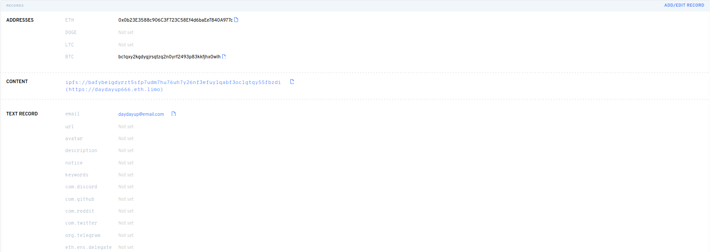
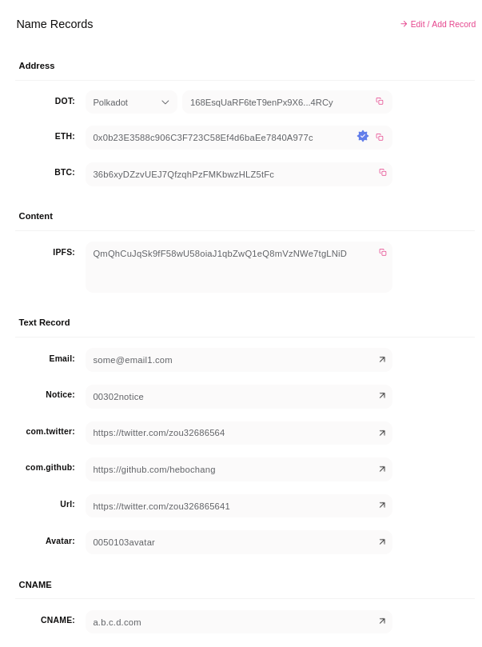

<!-- TOC depthFrom:1 depthTo:6 withLinks:1 orderedList:0 -->

- [接口](https://github.com/ddns-so/docs/blob/main/README.zn.CH.md#api%E6%8E%A5%E5%8F%A3)
	- [接口1：某个.eth .dot域名的详细信息](https://github.com/ddns-so/docs/blob/main/README.zn.CH.md#%E6%8E%A5%E5%8F%A31-%E6%9F%90%E4%B8%AAeth--dot-%E5%9F%9F%E5%90%8D%E7%9A%84%E8%AF%A6%E7%BB%86%E4%BF%A1%E6%81%AF)
	- [接口2：反向解析（根据 ETH地址 ，获得 ens / pns 域名）](https://github.com/ddns-so/docs/blob/main/README.zh-cn.md#reverse%E4%BD%A0%E7%9A%84eht%E5%9C%B0%E5%9D%80-%E6%A0%B9%E6%8D%AE-eth%E5%9C%B0%E5%9D%80-%E8%8E%B7%E5%BE%97-ens--pns-%E5%9F%9F%E5%90%8D)

<!-- /TOC -->

# API接口

## /name/:<你的域名>: 查询某个.eth / .dot 域名的详细信息

发起HTTP GET请求：

请求的内容如下：

- [形式1：/name/vitalik.eth](https://github.com/ddns-so/docs/blob/main/README.zh-cn.md#%E5%BD%A2%E5%BC%8F1namevitaliketh)

- [形式2：/name/vitalik.eth?is_show_subdomains=yes](https://github.com/ddns-so/docs/blob/main/README.zh-cn.md#%E5%BD%A2%E5%BC%8F2namevitalikethis_show_subdomainsyes)

- [形式3：/name/zzzzzzzzzzzzzzzzzzzzz.dot](https://github.com/ddns-so/docs/blob/main/README.zh-cn.md#%E5%BD%A2%E5%BC%8F3namezzzzzzzzzzzzzzzzzzzzzdot)

- [形式4：/name/zzzzzzzzzzzzzzzzzzzzz.dot?is_show_subdomains=yes](https://github.com/ddns-so/docs/blob/main/README.zh-cn.md#%E5%BD%A2%E5%BC%8F4namezzzzzzzzzzzzzzzzzzzzzdotis_show_subdomainsyes)

返回结果举例：

### 形式1：/name/vitalik.eth

形式1返回的内容如下：

```jsx
{
  "result": "ok",       // 请求成功的标志
  "data": {                 // 下面是具体的返回内容
    "name": "vitalik.eth",    // 表示查询域名，完整的域名， 包含.eth
    "nameHash": "0xee6c4522aab0003e8d14cd40a6af439055fd2577951148c14b6cea9a53475835",           // nameHash
    "labelName": "vitalik",   // labelName，域名的名称，不包含.eth

    // labelhash
    "labelhash": "0xaf2caa1c2ca1d027f1ac823b529d0a67cd144264b2789fa2ea4d63a67c7103cc",
    // 该域名的所有者
    "owner": "0xd8da6bf26964af9d7eed9e03e53415d37aa96045",
    // 父级域名的labelHash
    "parent": "0x93cdeb708b7545dc668eb9280176169d1c33cfd8ed6f04690a0bcc88a93fc4ae",
    "subdomainCount": 0,  // 表示查询域名的子域名数量
    "ttl": null,  // ttl
    "cost": "0",  // 成本
    "expiryDate": "2032-05-04 05:50:24 +0800",  // 表示查询域名的到期时间
    "registrationDate": "2020-02-07 02:23:40 +0800",  // 表示查询域名的注册时间
    // 下面的这些内容，都来自于图1
    "records": {
      // contenthash
      "contenthash": "0xe3010170122022fb6413aa794d5eb7a3906655f50f5ac41cbdd7933bc277f7192c9e2177c792",
      // 表示拥有者的ETH address
      "eth": "0xd8da6bf26964af9d7eed9e03e53415d37aa96045",
      "dot": "",    // 表示Polkadot地址
      "btc": "",    // 表示btc地址
      "text": [
        "url",      // 表示Twitter的URL
        "avatar"    // 表示头像的URL
      ],
      "pubkey": ""  // 表示公共密钥
    }
  }
}
```

<center>如图1所示, ETH域名的后台设置界面</center>
<p align="center"></p>
<p align="center">图1: ETH域名的后台设置界面</p>

### 形式2：/name/vitalik.eth?is_show_subdomains=yes

（在形式1的基础上，增加参数is_show_subdomains, 如果等于yes，就会显示该域名的subdomains的详细内容，得到这样的结果）

```jsx
{
  "result": "ok",       // 请求成功的标志
  "data": {                 // 下面是具体的返回内容
    "name": "vitalik.eth",    // 表示查询域名，完整的域名， 包含.eth
    "nameHash": "0xee6c4522aab0003e8d14cd40a6af439055fd2577951148c14b6cea9a53475835",           // nameHash
    "labelName": "vitalik",   // labelName，域名的名称，不包含.eth

    // labelhash
    "labelhash": "0xaf2caa1c2ca1d027f1ac823b529d0a67cd144264b2789fa2ea4d63a67c7103cc",
    // 该域名的所有者
    "owner": "0xd8da6bf26964af9d7eed9e03e53415d37aa96045",
    // 父级域名的labelHash
    "parent": "0x93cdeb708b7545dc668eb9280176169d1c33cfd8ed6f04690a0bcc88a93fc4ae",
    "subdomainCount": 3,  // 表示查询域名的子域名数量
    "ttl": null,  // ttl
    "cost": "0",  // 成本
    "expiryDate": "2032-05-04 05:50:24 +0800",  // 表示查询域名的到期时间
    "registrationDate": "2020-02-07 02:23:40 +0800",  // 表示查询域名的注册时间
    // 下面的这些内容，都来自于图1
    "records": {
      // contenthash
      "contenthash": "0xe3010170122022fb6413aa794d5eb7a3906655f50f5ac41cbdd7933bc277f7192c9e2177c792",
      // 表示拥有者的ETH address
      "eth": "0xd8da6bf26964af9d7eed9e03e53415d37aa96045",
      "dot": "",    // 表示Polkadot地址
      "btc": "",    // 表示btc地址
      "text": [
        "url",      // 表示Twitter的URL
        "avatar"    // 表示头像的URL
      ],
      "pubkey": ""  // 表示公共密钥
    },
    // 查询的域名的所有子域名，包含每个子域名的完整的域名名称、id和子域名
    "subdomains": [
      {
        "id": "0x1bd80197873de285b67cc9dcf3b2bf196ec112b701f34e89dfc4bfc9fb17b0b2",
        "name": "[4da432f1ecd4c0ac028ebde3a3f78510a21d54087b161590a63080d33b702b8d].[68562fc74af4dcfac633a803c2f57c2b826827b47f797b6ab4e468dc8607b5d0].[4f5b812789fc606be1b3b16908db13fc7a9adf7ca72641f84d75b47069d3d7f0]",
        "subdomains": []
      }
    ]
  }
}
```

<center>如图1所示, ETH域名的后台设置界面</center>
<p align="center"></p>
<p align="center">图1: ETH域名的后台设置界面</p>

### 形式3：/name/zzzzzzzzzzzzzzzzzzzzz.dot

形式3返回的内容如下：

```jsx
{
  "result": "ok",     // 请求成功的标志
  "data": {               // 下面是具体的返回内容
    "name": "zzzzzzzzzzzzzzzzzzzzz.dot",   // 表示查询域名，完整的域名，包含.dot
    "namehash": "0xe07a052cca727930eaed3b1f7551eaf3a9f2aa71122ad910db6776dd1aeb4681",         // nameHash
    "labelName": "zzzzzzzzzzzzzzzzzzzzz",  // labelName
    // labelhash
    "labelhash": "0xc40a066a5a14b7cf1a860b96cab9c3b5b945f77824de421109012bed498c151b",
    // 表示查询域名的拥有者的address
    "owner": "0x0b23e3588c906c3f723c58ef4d6baee7840a977c",
    // 表示查询域名的父级域名的labelHash
    "parent": "0x3fce7d1364a893e213bc4212792b517ffc88f5b13b86c8ef9c8d390c3a1370ce",
    // 表示查询域名的到期时间
    "expiryDate": "2024-06-25 23:47:06 +0800",
    // 表示查询域名的注册时间
    "registrationDate": "2022-06-26 23:47:06 +0800",
    // 表示查询域名的子域名数量
    "subdomainCount": 12,

    // 下面的这些内容，都来自于图2
    "records": {
      "DOT": "168EsqUaRF6teT9enPx9X6dbHR7JbWN5hDeNAKtHGUPh4RCy", // 表示Polkadot地址
      "ETH": "0x0b23E3588c906C3F723C58Ef4d6baEe7840A977c",  // 表示Eth地址
      "BTC": "36b6xyDZzvUEJ7QfzqhPzFMKbwzHLZ5tFc",          // 表示btc地址
      "IPFS": "QmQhCuJqSk9fF58wU58oiaJ1qbZwQ1eQ8mVzNWe7tgLNiD",  // ipfs
      "Email": "some@email1.com",  // 表示email地址
      "Notice": "00302notice",     // 表示Polkadot地址
      "twitter": "https://twitter.com/zou326865641",   // 表示Twitter地址
      "github": "https://github.com/hebochang",        // 表示github地址
      "Url": "https://twitter.com/zou32686564",        // 表示twitter url
      "Avatar": "0050103avatar",                       // 表示avatar地址
      "CNAME": "a.b.c.d.com"                           // 表示c name地址
    }
  }
}
```

如图2所示, DOT域名的后台设置界面
<p align="center"></p>
<p align="center">图2: DOT域名的后台设置界面</p>

### 形式4：/name/zzzzzzzzzzzzzzzzzzzzz.dot?is_show_subdomains=yes

（在形式3的基础上，增加参数is_show_subdomains, 如果等于yes，就会显示该域名的subdomains的详细内容，得到这样的结果）

```jsx
{
  "result": "ok",   // 请求成功的标志
  "data": {             // 下面是具体的返回内容
    "name": "zzzzzzzzzzzzzzzzzzzzz.dot",   // 表示查询域名
    "namehash": "0xe07a052cca727930eaed3b1f7551eaf3a9f2aa71122ad910db6776dd1aeb4681",  // namehash
    "labelName": "zzzzzzzzzzzzzzzzzzzzz",  // labelname
    // labelhash
    "labelhash": "0xc40a066a5a14b7cf1a860b96cab9c3b5b945f77824de421109012bed498c151b",
    // 表示查询域名的拥有者的address
    "owner": "0x0b23e3588c906c3f723c58ef4d6baee7840a977c",
    // 表示查询域名的父级域名的labelHash
    "parent": "0x3fce7d1364a893e213bc4212792b517ffc88f5b13b86c8ef9c8d390c3a1370ce",
    "expiryDate": "2024-06-25 23:47:06 +0800",
    // 表示查询域名的注册时间
    "registrationDate": "2022-06-26 23:47:06 +0800",
    // 表示查询域名的子域名数量
    "subdomainCount": 12,
    // 下面的这些内容，都来自于图2
    "records": {
      "DOT": "168EsqUaRF6teT9enPx9X6dbHR7JbWN5hDeNAKtHGUPh4RCy", // 表示Polkadot地址
      "ETH": "0x0b23E3588c906C3F723C58Ef4d6baEe7840A977c",  // 表示Eth地址
      "BTC": "36b6xyDZzvUEJ7QfzqhPzFMKbwzHLZ5tFc",          // 表示btc地址
      "IPFS": "QmQhCuJqSk9fF58wU58oiaJ1qbZwQ1eQ8mVzNWe7tgLNiD",  // ipfs
      "Email": "some@email1.com",  // 表示email地址
      "Notice": "00302notice",     // 表示Polkadot地址
      "twitter": "https://twitter.com/zou326865641",   // 表示Twitter地址
      "github": "https://github.com/hebochang",        // 表示github地址
      "Url": "https://twitter.com/zou32686564",        // 表示twitter url
      "Avatar": "0050103avatar",                       // 表示avatar地址
      "CNAME": "a.b.c.d.com"                           // 表示c name地址
    },
    // 查询的域名的所有子域名，包含每个子域名的完整的域名名称和拥有者的address
    "subdomains": [
      {
        "name": "zfd2.zzzzzzzzzzzzzzzzzzzzz.dot",
        "owner": "0x0b23e3588c906c3f723c58ef4d6baee7840a977c"
      },
      {
        "name": "zfd.zzzzzzzzzzzzzzzzzzzzz.dot",
        "owner": "0x0b23e3588c906c3f723c58ef4d6baee7840a977c"
      }
    ]
  }
}
```

<center>如图2所示, DOT域名的后台设置界面</center>
<p align="center"></p>
<p align="center">图2: DOT域名的后台设置界面</p>

## /reverse/<你的EHT地址>: 根据 ETH地址 ，获得 ens / pns 域名

HTTP GET request:

- [形式1：/reverse/ens/0xa1b2c3d4](https://github.com/ddns-so/docs/blob/main/README.zh-cn.md#%E5%BD%A2%E5%BC%8F-1reverseens0xa1b2c3d4)

- [形式2：/reverse/pns/0xa1b2c3d4](https://github.com/ddns-so/docs/blob/main/README.zh-cn.md#%E5%BD%A2%E5%BC%8F-2reversepns0xa1b2c3d4)

返回结果示例：

### 形式 1：/reverse/ens/0xa1b2c3d4

形式1返回的内容如下：

```jsx
{
  "result": "ok",       // 请求成功的标志
  "address": "0x0b23E3588c906C3F723C58Ef4d6baEe7840A977c", //  表示查询的address
  "data": "daydayup666.eth" //  表示返回的结果
}
```

### 形式 2：/reverse/pns/0xa1b2c3d4

形式2返回的内容如下：

```jsx
{
  "result": "ok",       // 请求成功的标志
  "address": "0x0b23E3588c906C3F723C58Ef4d6baEe7840A977c", //  表示查询的address
  "data": "ttt112.dot" //  表示返回的结果
}
```
